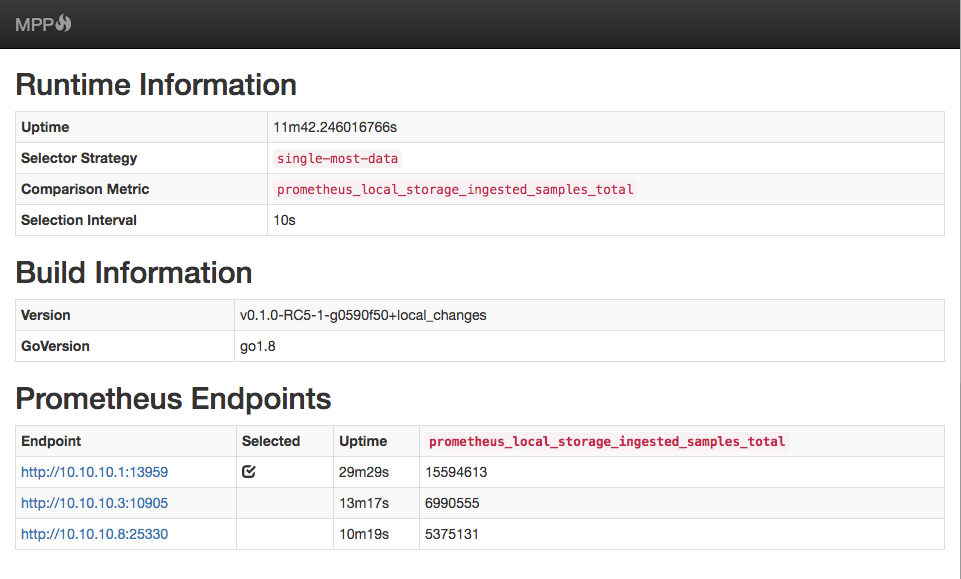

mpp
===

Multi-prometheus proxy (**mpp**) exists to forward incoming query requests to one of a set
of multiple prometheus instances deployed as HA duplicates of each other.

Motivation
---

As the recommended pattern for running Prometheus in HA mode is to [run multiple duplicate instances](https://github.com/prometheus/prometheus/issues/1500)
(same configuration, scraping the same targets independently), a method is needed to route queries
appropriately between those instances to provide a seemless experience for clients when individual
instance failures occur.

How it works
---

MPP acts as a proxy sitting in front of multiple prometheus instances, choosing one or more instances
to receive requests based on a configurable selector strategy. Candidate instances are found using
a configured _locator_ mechanism, of which Marathon, Kubernetes and endpoints file are supported.

Discovery
---

Prometheus endpoints can be discovered via the Marathon API, the Kubernetes API, or by providing an
endpoints file which is scanned on a regular interval.

**Marathon** discovery is configured using:

- `--marathon-url`: The marathon API endpoint to contact.
- `--marathon-apps`: A comma-separated list of apps to query for endpoints.
- `--marathon-principal-secret`: (Optional) A DCOS principal-secret object used to authenticate to Marathon.
- `--marathon-auth-endpoint`: (Optional) Overrides the auth-endpoint contained within the principal secret object.

**Kubernetes** discovery _(Coming soon)_ is configured using:

- `--kubeconfig`: The path to the kubeconfig file used to locate the cluster and authenticate.
- `--kube-pod-selector`: A pod-selector string used to locate the pods containing the endpoints. 

**Endpoints file** discovery is configured using `--endpoints-file` -- the path to a file containing one
endpoint per line.

Selection
---

Traffic is routed based on the chosen `--routing-strategy`:

- `single-most-data`: This strategy always routes traffic to a single prometheus endpoint, determined
  by whichever endpoint contains the _most_ data, measured by total ingested samples count.

- `minimum-history:{min-history-duration}`: This strategy routes traffic to a randomly selected prometheus endpoint having
  at least M of sample history.

- `random`: This strategy routes traffic to a randomly selected prometheus endpoint.

Session Affinity
---

Stickiness is configured via the `--affinity-options` flag, which accepts a comma-separated
list of one or more of the options:

- `cookies`: (endabled by default) Sets a cookie on the first request and uses that in subsequent requests to route
  to the same backend.
- `sourceip`: Examines the `X-Forwarded-For` header, falling back to the actual source IP; the chosen route is cached
  with an LRU-based cache for that value.

Health
---

The proxy responds with `OK` to requests on the `/mpp/health` path.

Metrics
---

Prometheus-styel metrics are available at the `/mpp/metrics` path.

Status Page
---

The proxy displays a status summary (see below) on the `/mpp/status` path.

  

